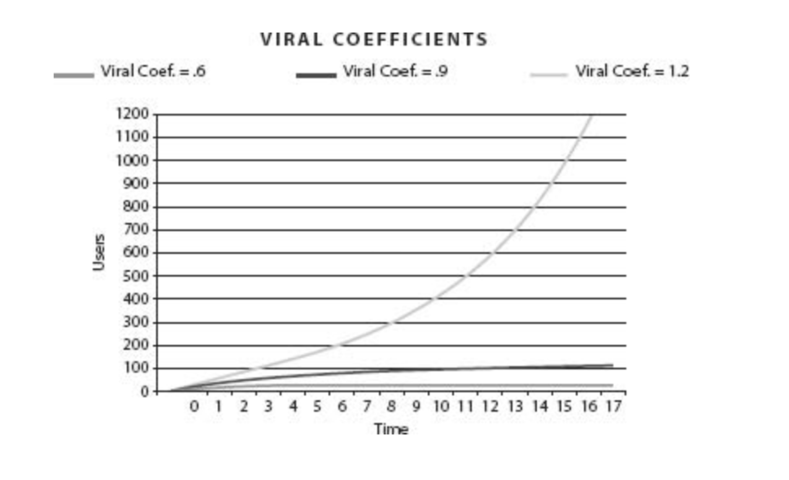
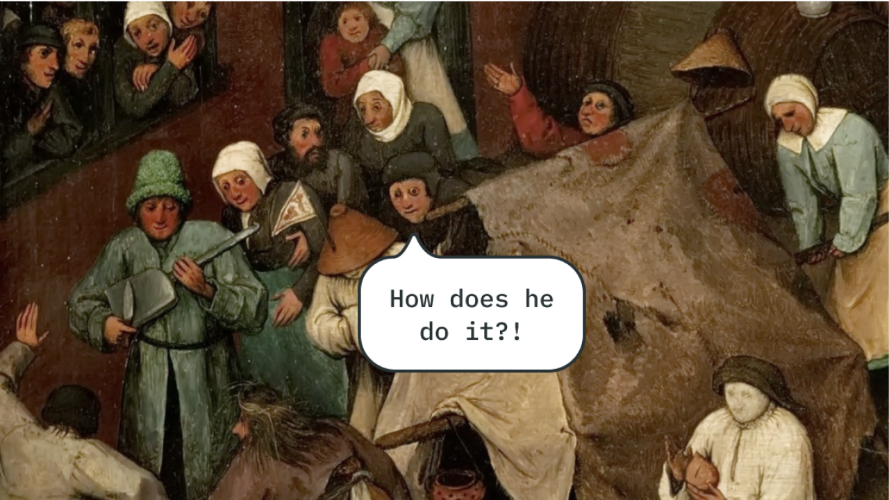
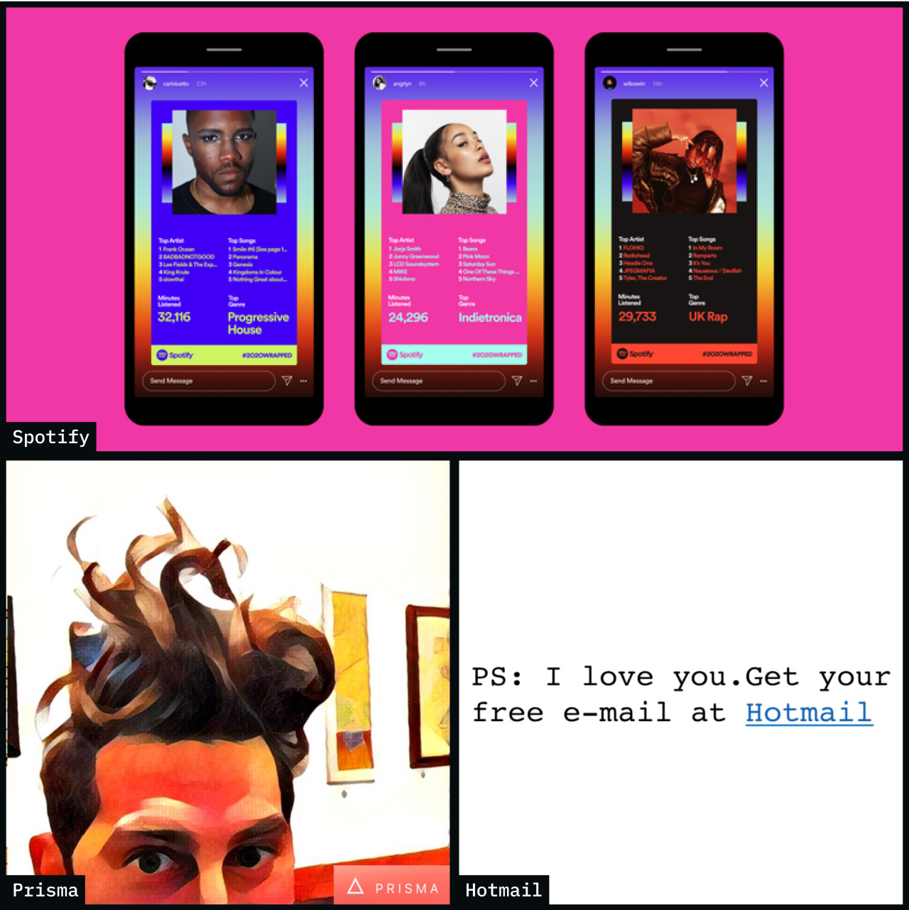
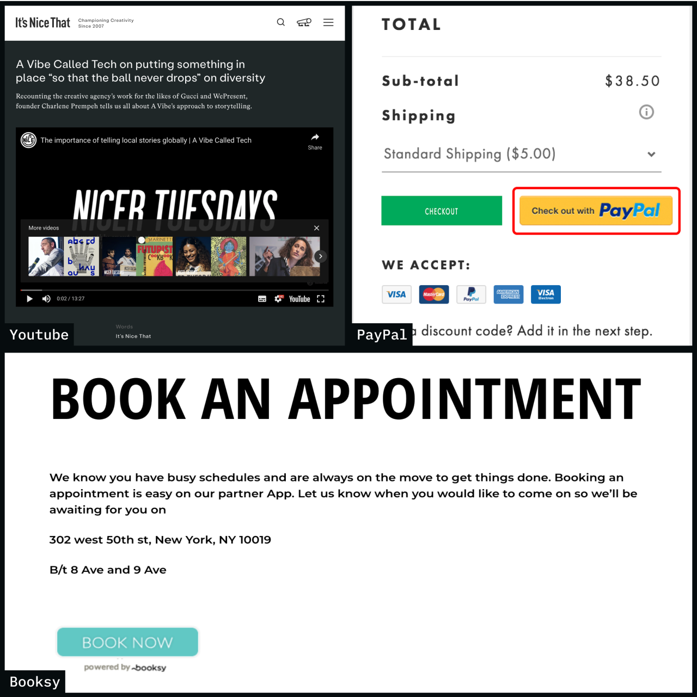
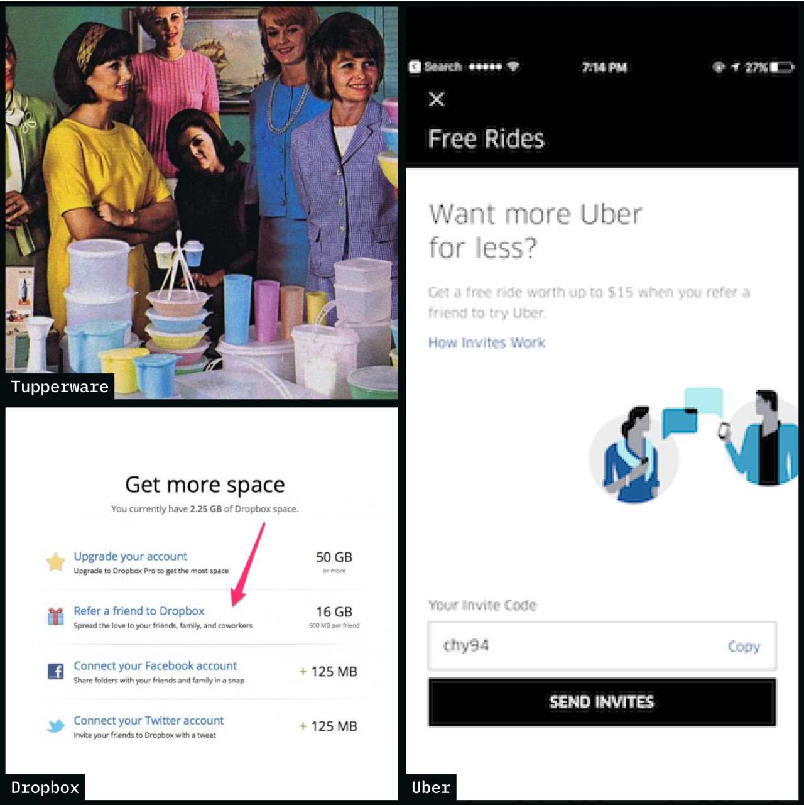
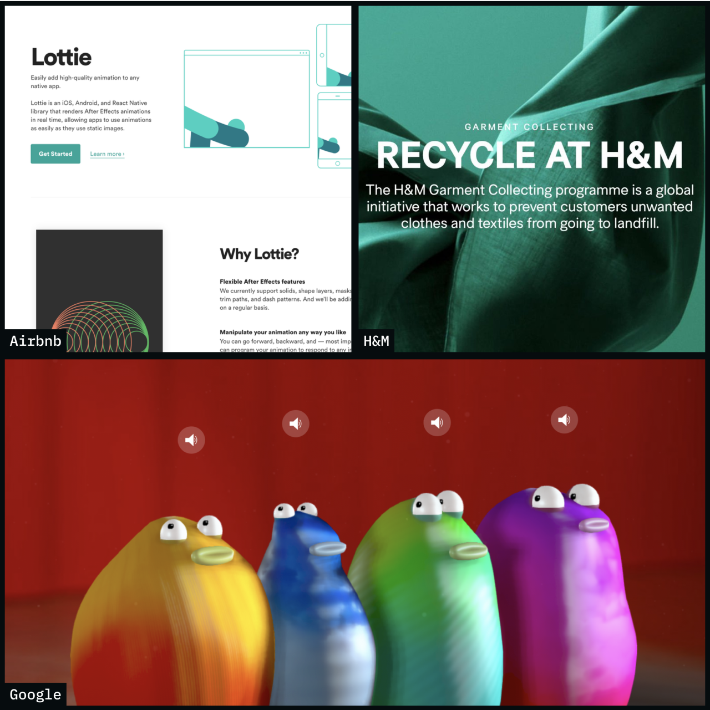

This article is the first part of two, which is theoretical and describes how companies leverage virality. The second one is about the workshop intended to ideate on how we can use it and turntheory into practice.

## What is virality technically?

It can be put as audience-driven growth - a company grows because each new user begets more users. Quite a simple concept to explain, much harder to achieve. Adam L. Penenberg, in his book called [“Viral Loop”](https://www.goodreads.com/en/book/show/6912295), illustrates it with the use of Viral Coefficient - the ratio between the number of acquired users to the users referred by them:

 

So you can see - if, in average, ten customers start to bring more than ten others, you begin to grow exponentially and become viral. Otherwise, you are striving to the plain and have to rely on the acquisition effort only. Viral product continues to grow the audience without extra input. It does not mean you should stop all the marketing spending or any activity; it means you are in a booster mode and can make more use of it by acting cleverly.

---

## Virality types

Your users are bringing new clients to you in different ways - they can spread the word intentionally or not, impose someone to join or just arose interest:

### 1. Word of mouth virality

That is something most of us think of hearing the word "Virality". It usually happens when the product is so exciting that users mention it to everyone around. Or it makes some of their routines much easier and becomes one of those. Some examples:

- "Google it!"
- “Let’s switch to Notion/Next.js/Figma”
- "Looking where to stay? Check Airbnb"

---

### 2. Demonstration virality

In this case users share something not by telling but by showing, provoking interest in the instrument. By showing the results of usage you basically provide a sample - share a Pintrest moodboard, add some filters and post vacation photos or find a restaurant nearby quicker then anybody else. So your clients may get some "How did you..?" questions. Some more examples:

- "Made with Squarespace/Readymag/Tilda..."
- "- How did you get there so quickly? - I've used Uber/Lime/"
- "- Great slides, when did you find time to do that?! - I've used Dropbox Paper / Canva / Pitch"

---

### 3. Outbreak virality

Some products seem to be a must today - we communicate online, read news, consume content or shop online and our habits list continues to evolve. At some point, we start to notice that everyone is using some app or see it on the news, so it looks like we should at least take a look. This is the case of outbreak virality.

- Clubhouse
- Game of Thrones or Squid Game
- TikTok

---

### 4. Network Virality

Some products provide the more value the more users there are - you probably won't visit a Zoom party alone, so you have to invite someone. It is true for almost any social network. Or in example with Paypal - you need an account to send money as well as your counterpart should have one to receive it, which is a pretty nice motive to sign up. So in case, if the strength of a product is in the network, users invite others to join to get more use out of it. If the product is a good one.

- Zoom
- Paypal payment
- Probably, all the messengers you use

---

### 5. Incentive Virality

Pretty straight this one is - you can set a reward for any new referred user. It can be money, a discount or some other valuable currency you have in your product - Dropbox was paying in megabytes.

- Uber bonus
- Dropbox free space
- Airbnb discount

---

## Common traits

Virality is often associated with marketing but it also requires your product to be built in a way easy to share or contain the motivation to tell spread a word about it. Penenberg's "Viral loop" mentioned above contains the common traits of viral products and some of them still are applicable today:

- **Free:**
  a core value of your product should be available to the clients at no charge and easy to get so that they can get a taste of it;
- **Organizational technology:** don’t create content — let your users do it and simply organize it. Facilitating access can lead to a mass audience. Take a look at Google or Instagram.
- **Simple concept:** easy and intuitive to use.
- **Built-in virality:** users spread the product purely out of their own self-interest and, in the process, offer a powerful word-of-mouth endorsement to each subsequent user. (And word of mouth is widely viewed as the best form of advertising.)
- **Network effects:** The more who join, the more who have an incentive to join. A telephone, for example, becomes continually more helpful to those, who already have one as more people are added to the network.
- **Stackability:** A viral network can be laid over another, fostering the other’s growth (PayPal as a payment tool for online payments; YouTube video embedding).

---

## In use mechanisms

### 1. Sharable content

Your product may make some use of user data or specific functionality. It allows the creation of unique sharable materials which serve as a marketing tool itself, making users increase the brand awareness.

- **Spotify** - Several times a year you can see your social networks get full of [Spotify Wrapped](https://www.vox.com/culture/22814121/spotify-wrapped-2021-algorithm-data-privacy) - everyone shares their listener’s stats. It’s a great example of how company gets use of the data it owns;
- **Snapchat, Instagram, TikTok, Prisma…** - Users share unique content made with the apps on other platforms, which usually mention the tool. This is an example of how this apps facilitate virality with sharing mechanisms;
- **Hotmail** - You may know the [famous story](https://techcrunch.com/2009/10/18/ps-i-love-you-get-your-free-email-at-hotmail/) about “Get your free email at Hotmail.com” footer. Every message sent from Hotmail used to contain this little promo line and let the company grow the awareness and userbase exponentially.

---

### 2. Commodities

Some solutions are stacked over the other services attracting users on other platforms. If you can take some headaches off by providing a utility, you can get use of being omnipresent throughout the other products.

- **Youtube** -It was and it is still hard to imagine a website without an embedded Youtube video years ago
- **Paypal** - It has become a convenient payment instrument for both sides of deal (mostly on eBay in the yearly days) + 10$ joining reward stimulated link sharing even more;
- **“Book me” apps (Booksy, Bookme …)** - Simple (but still branded) booking tools empower entrepreneurs to process clients and clients are happy to see availability and avoid calling. But it also allowed those apps to enter other platforms same as PayPal did at zero price;

---

### 3. Deal

Offers made by products stimulate users to invite others to the platform. It's a very straignt concept – you pay only for the leads that reach some set point.

- **Tupperware** - Pioneer of viral marketing with the [Tupperware parties](https://en.wikipedia.org/wiki/Tupperware#Tupperware_parties) - the party is run by a Tupperware "consultant" for a host or hostess who invites friends and neighbours into their home to see the product line. This way, a customer can become a distributor and get an income share;
- **Dropbox** - Dropbox used to give away its own currency – you could get extra cloud storage for inviting new users;
- **Uber** - Invited users bring you both a deposit.

---

### 4. Content

Companies may spread brand awareness and build trust through expert content or tools. By providing helpful information for the domain, you are giving free advice - so your client gets some value before even learning about you. Alongside, it brings up scenarios for your services.

- **Inside intercom** - [Inside intercom](https://www.intercom.com/blog/) has a nice blog on building a product - taking into account their b2b model, it's accurate targeting for their audience;
- **App store** - Curated app lists help to grow the audience for the apps and increase downloads for the market;
- **Aviasales** - [Travel blog](https://www.aviasales.ru/psgr) by a travel company not only tells you about
  possible destinations but provides a ticket.

---

### 5. Side missions

Entertaining, useful and exciting initiatives, which are not obligatory connected to the primary company mission create a news buzz and bring another reason to mention the company name.

- **Airbnb lottie** - [Bodymovin](https://exchange.adobe.com/creativecloud.details.12557.bodymovin.html) animation tool [upgrade](https://airbnb.design/lottie/) along with [code style guide](https://airbnb.io/javascript/react/) adds up to the company authority;
- **Recycle at H&M** - Recycling initiative has created another reason to bring a visit;
- **Google experiments** - Quite a lot of [Google Experiments](https://experiments.withgoogle.com/) help to increase the brand’s image as an innovative and versatile one.

---

## What's now?

It was assembled and written as a theoretical part of the Virality ideation workshop. I wanted to illustrate what is virality and how it functions to my team at StarOfService. You can find out how we used this information to estimate our viral potential and discover opportunities in Virality Workshop.
